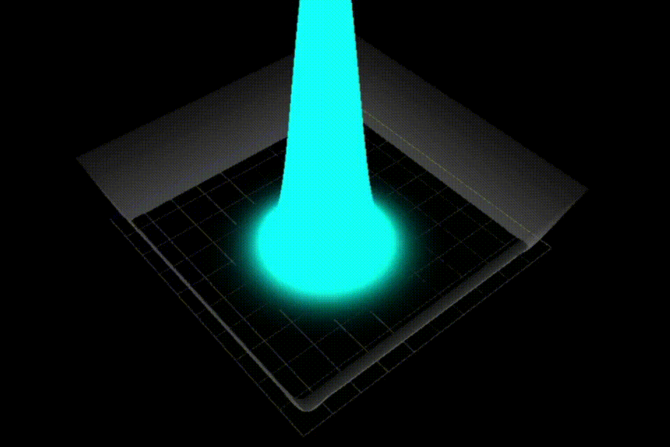

# Quaint

[](https://www.gnu.org/licenses/gpl-3.0)
[](https://www.python.org/)
[](https://docs.astral.sh/uv/)

> A Python-based desktop application for real-time, interactive 3D visualization of the time-dependent 2D Schrödinger equation.



## About

**Quaint** provides a real-time, interactive environment to explore quantum mechanics. Built with **PyQt6**, **PyQtGraph**, **SciPy**, **NumPy**, and **PyOpenGL**.

## Features

* **Custom Potentials:** Use a built-in canvas to brush or erase custom potential energy barriers, or load mathematical presets (e.g., Harmonic Oscillator, Gaussian Bump).
* **Initial Conditions:** Visually set the wave packet's starting position ($r_0$), momentum vector ($k_0$), spatial spread ($\sigma$), and mass.
* **Multiple Solvers:** Choose between different numerical integration methods (Crank-Nicolson, SSFM or symmetric SSFM) to calculate the wave's evolution.
* **High-Performance 3D Rendering:** View the probability density mapped to height (Z-axis) and the complex quantum phase mapped to color, fully cached for lag-free playback.

## Installation

This project uses [uv](https://docs.astral.sh/uv/).

**1. Clone the repository**
```
git clone https://github.com/Hansus00/Quaint
cd Quaint
```

**2. Install Dependencies** Synchronize the environment using uv:
```uv sync```

**3. Run the Application**
```uv run main.py```

## Usage
> For a comprehensive guide, check out the complete [User Manual (PDF)](docs/manual.pdf).

### Setting up the Physics
Click the **Simulation Setup** button to customize your experiment:
* **Numerical Solver:** Select your preferred integration method (Crank-Nicolson  SSFM).
* **Potential Energy:** Choose a preset potential or select **"Brush Potential"** to draw a custom landscape directly onto the canvas.
* **Wavepacket Configuration:** Select **"Set Wavepacket"** to click-and-drag on the canvas.
  * The **dot** represents the starting position ($r_0$).
  * The **red line** represents the momentum vector ($k_0$).
* **Initial Parameters:** Adjust covariant matrix elements ($s_{xx}$, $s_{yy}$, $s_{xy}$) and particle mass.
* Click **Save & Update Simulation** to compute the wave's evolution over time.

### Playback Controls
* Use the **Play** and **Pause** buttons to watch the animation.
* Drag the **timeline slider** to manually scrub forward and backward through time.

### Camera Controls & View
* **Rotate:** Left-click and drag on the 3D viewport.
* **Zoom:** Scroll your mouse wheel in and out.
* **Settings:** Click the **Settings** button to adjust playback framerate, total number of frames, grid resolution, and visual amplitude scaling of the wave and potential meshes.

## Authors
- Jacek Winiarczyk [@Jaclav](https://github.com/Jaclav)
- Szymon Borowski [@Szymon-Borowski](https://github.com/Szymon-Borowski)
- Franciszek Hansdorfer [@Hansus00](https://github.com/Hansus00)
- Bartosz Łakomy [@paluzki](https://github.com/paluzki)
- Adam Podkowiński [@adam-podkowinski](https://github.com/adam-podkowinski)

This project was developed under the mentorship of Bartosz Kasza ([@bkasza](https://github.com/bkasza)) at the Faculty of Physics, University of Warsaw.

<a href="https://github.com/Hansus00/Quaint/graphs/contributors">
  
</a>
